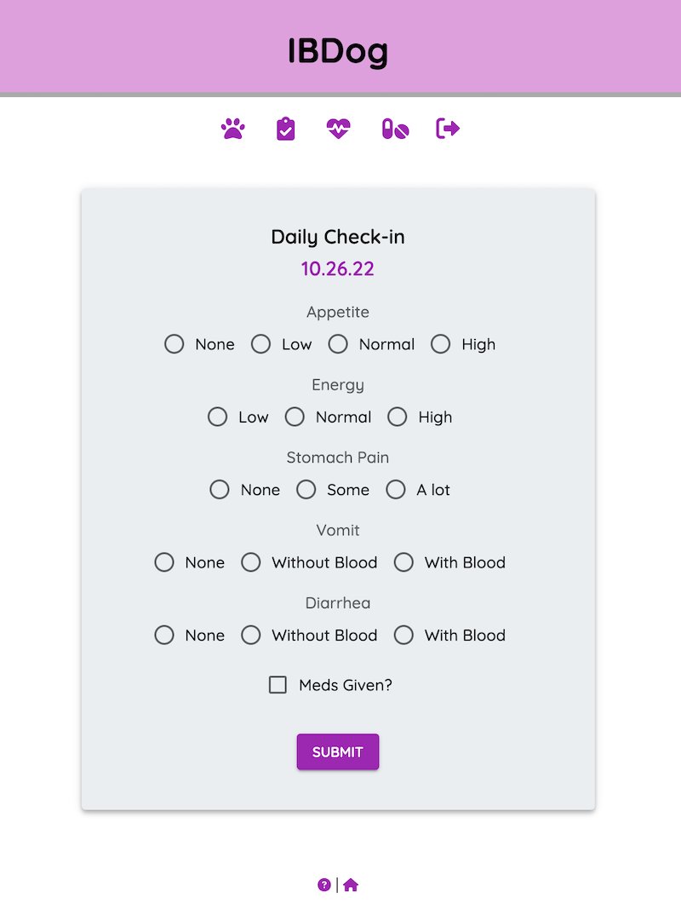

# IBDog

Pet owners play a crucial role in navigating veterinary healthcare systems and advocating for their animals. IBDog improves quality of life for dogs with Inflammatory Bowel Disease by helping owners better manage the chronic condition and communicate their observations with treating veterinarians. Users log symptoms, update medications, and see their dog's condition over time via a health score heatmap. 

Check out the deployed app [here](https://ibd-dog.herokuapp.com/#) on Heroku. 

### Screenshots
<h4 align="center">Home</h4>

 

<h4 align="center">Check-In</h4>

 

<h4 align="center">Health Status</h4>

 

<h4 align="center">Medications</h4>

 

### Built With

React.js | Redux | Redux-Saga | Material UI | PostgreSQL | Node.js | Express.js | JavaScript | CSS

### Usage

#### Prerequisites

- [Node.js](https://nodejs.org/en/)
- [PostrgeSQL](https://www.postgresql.org/)
- [Nodemon](https://nodemon.io/)

#### Installation

1. Create a database named `ibd_dog` and execute the queries from `database.sql` to create the `user`, `dog`, `medication`, and `symptom` tables. 
2. Within a code editor, open a terminal window and install the dependencies by running:
    - `npm install`
3. Run `npm run server` to start the server in one terminal window. Open a second terminal window, and run `npm run client` to start the client. Access the application at `localhost:3000/#/` in the browser.

#### Registration and Login

1. To register as a new user, click `REGISTER`. Enter a username, password, dog's name, and dog's birthday.
2. To login as an existing user, enter the username and password and click `LOGIN`. 

#### Home

1. Click the paw icon under the header or the home icon in the footer to access the Home page. 
2. This page displays the dog's name, birthday, current food, and active medications.
3. To make edits to the dog's name, birthday, food, or image, click `EDIT`. Update the fields with any changes. Click `SAVE` to preserve the changes or `CANCEL` to discard.

#### Check-In

1. Click the clipboard icon under the header to access Check-In.
2. Use the radio buttons to select answers to the five questions and the checkbox to indicate whether medications were given that day. The answers to these questions are converted to a total score and color that is displayed on the the Health Status page.
3. Click `SUBMIT` to enter a record. A record can be submitted once per day.

#### Health Status

1. Click the heart icon under the header to access Health Status and view prior Check-In submissions.
2. Click the pencil icon to edit entries. Click the floppy disk to save changes. Click `x` to discard changes. 
3. Click the trash icon to delete a record. A prompt will ask for confirmation prior to deleting.
4. Use the dropdown in the table footer to change the number of records displayed on each page and the left and right arrows to navigate from page to page. 

#### Medications

1. Click the pill icon under the header to access Medications.
2. Add a medication by clicking the purple plus button above the Medications table. Enter a name, dosage, frequency, and optional start date. Click `SUBMIT` when done. Medications are active by default when added.
3. Mark a medication inactive by deselecting the checkbox under the Active column. The date the medication was marked inactive is generated in the End column if a start date was provided.
4. Delete a medication by clicking the trash icon. A prompt will ask for confirmation prior to deleting.
5. Active medications appear on the Medications page as well as on the Home page. 

